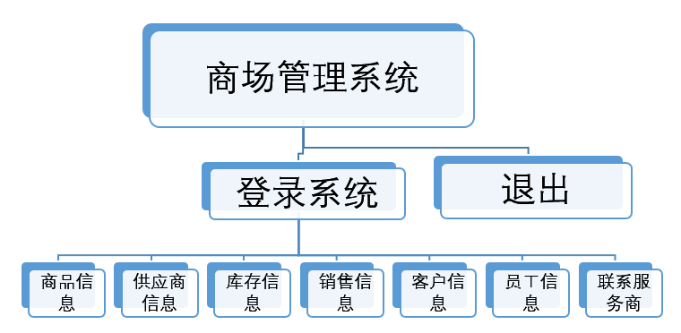
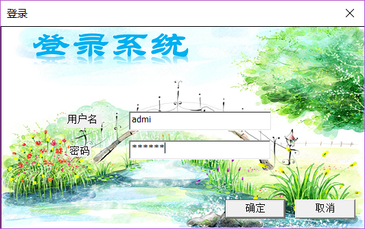

# MMS
A small mall management system/小型商场管理系统

通过ODBC数据源连接SQL Server 数据库，使用 MFC 创建程序

Debug目录下**ChatServer** 和 **ChatClient** 文件夹是聊天程序代码，为商场管理系统提供“联系供应商功能”，可作为独立程序使用

## 系统原理

## 系统结构

## 登录界面

## 系统主页

